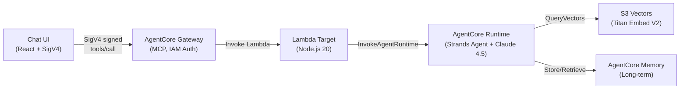

# Party Supply Chat Agent

A lightweight chat agent built with Amazon Bedrock AgentCore using Claude Sonnet 4.5 in us-west-2. Uses the Strands Agents SDK, AgentCore Gateway with IAM auth, S3 Vectors RAG, and long-term memory.

## Architecture



## Prerequisites

- AWS Account with credentials configured
- AWS CLI v2 ([Install Guide](https://docs.aws.amazon.com/cli/latest/userguide/getting-started-install.html))
- Node.js 20+ and npm 9+
- Docker (local testing only; CodeBuild handles remote builds)
- AgentCore CLI: `npm install -g @aws/agentcore`

### AWS Credentials

1. Sign into the [AWS Console](https://console.aws.amazon.com/) with a role that has the [required permissions](docs/iam-policy.json).
2. Run `aws login` — it picks up your active console session.

```bash
aws login
aws sts get-caller-identity
```

### Model Access

Enable in the [Bedrock console](https://console.aws.amazon.com/bedrock/) (us-west-2):

| Model | ID |
|-------|----|
| Claude Sonnet 4.5 | `us.anthropic.claude-sonnet-4-5-20250929-v1:0` |
| Titan Text Embeddings V2 | `amazon.titan-embed-text-v2:0` |

## Quick Start

```bash
# 1. Install
npm install && cd agent && npm install && cd ../chat-ui && npm install && cd ..

# 2. Login
aws login && export AWS_REGION=us-west-2

# 3. Deploy
./scripts/deploy.sh --all

# 4. Run UI
./scripts/run-local-ui.sh --port 3000
```

> **Windows users:** Run all scripts using Git Bash or WSL, not PowerShell directly.

The deploy script handles everything: seed data generation, S3 Vectors, agent runtime, gateway, Lambda, and wiring.

## Scripts

| Script | Purpose |
|--------|---------|
| `./scripts/deploy.sh --all` | Full deployment |
| `./scripts/deploy.sh --agent` | Deploy agent + gateway + memory only |
| `./scripts/deploy.sh --lambda --gateway-target` | Redeploy Lambda + rewire |
| `./scripts/deploy.sh --status` | Show status + update UI config |
| `./scripts/run-local-ui.sh` | Start chat UI locally |
| `./scripts/cleanup.sh` | Tear down all resources (correct order) |

Run `./scripts/deploy.sh --help` for all switches.

## Project Structure

```
.
├── agent/                    # Strands Agent (TypeScript)
│   ├── agent.ts              # Agent with RAG + memory tools
│   ├── tools/
│   │   ├── rag-search.ts    # S3 Vectors search
│   │   └── memory.ts        # AgentCore Memory integration
│   └── Dockerfile
├── lambda/                   # Gateway Lambda Target
│   ├── index.mjs             # Invokes AgentCore Runtime
│   └── tools.json            # MCP tool schema
├── chat-ui/                  # React Chat UI
│   └── src/
│       ├── components/ChatWindow.tsx
│       └── lib/sigv4.ts
├── scripts/
│   ├── deploy.sh
│   ├── cleanup.sh
│   ├── run-local-ui.sh
│   └── generate-seed-data.ts
├── docs/
│   ├── iam-policy.json       # Least-privilege IAM policy
│   ├── adding-tools.md       # Guide: adding new tools
│   └── tech-features.md      # Technical details & gotchas
└── agentcore/
    └── agentcore.json        # Runtime + Gateway + Memory spec
```

## Documentation

| Doc | Description |
|-----|-------------|
| [`docs/iam-policy.json`](docs/iam-policy.json) | Least-privilege IAM policy (replace `YOUR_ACCOUNT_ID` / `YOUR_REGION`) |
| [`docs/adding-tools.md`](docs/adding-tools.md) | Step-by-step guide for adding new tools to the agent |
| [`docs/tech-features.md`](docs/tech-features.md) | Technical details: memory, RAG, SDK workarounds, gotchas |

## Cleanup

```bash
./scripts/cleanup.sh
```

Deletes in order: gateway targets → gateway → Lambda → IAM role → Memory → ECR → CloudFormation stack → S3 Vectors → local artifacts.
