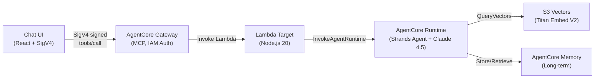

# Party Supply Chat Agent

A lightweight chat agent built with Amazon Bedrock AgentCore using Claude Sonnet 4.5 in us-west-2. Uses the Strands Agents SDK, AgentCore Gateway with IAM auth, S3 Vectors RAG, and long-term memory.

## Architecture



## Prerequisites

- AWS Account with credentials configured
- AWS CLI v2 ([Install Guide](https://docs.aws.amazon.com/cli/latest/userguide/getting-started-install.html))
- Node.js 20+ and npm 9+
- Docker (local testing only; CodeBuild handles remote builds)
- AgentCore CLI:
  ```bash
  npm install -g @aws/agentcore @aws-sdk/region-config-resolver
  ```

> **Note:** npm deprecation warnings (e.g., `glob@10.5.0`) from `@aws/agentcore` are suppressed via `.npmrc` and do not affect functionality. The `@aws-sdk/region-config-resolver` is required as a peer dependency for the AgentCore CLI.

### AWS Credentials

1. Sign into the [AWS Console](https://console.aws.amazon.com/) with a role that has the [required permissions](docs/iam-policy.json).
2. Run `aws login` — it picks up your active console session.

```bash
aws login
aws sts get-caller-identity
```

### Model Access

The agent uses two Bedrock foundation models:

| Model | ID | Subscription |
|-------|----|----|
| Claude Sonnet 4.5 | `us.anthropic.claude-sonnet-4-5-20250929-v1:0` | Required (Anthropic FTU form + agreement) |
| Titan Text Embeddings V2 | `amazon.titan-embed-text-v2:0` | Available by default in most accounts |

AWS has deprecated the Bedrock Model Access console page — model access must now be managed via API/CLI. Use the helper script:

```bash
./scripts/enable-model-access.sh
```

This script:
1. Prompts for Anthropic First-Time-Use form details (required once per account)
2. Subscribes the account to Claude Sonnet 4.5 (and Titan if not already enabled)
3. Polls for `AVAILABLE` status (up to 2 minutes)

**Example interactive run:**

```text
[1/4] Anthropic First-Time-Use Form
  Enter your company/organization name: Acme Party Co
  Enter company website (or GitHub/portfolio URL): https://github.com/acme/party-agent
  Industry (e.g., Technology, Retail, Education): Retail
  Briefly describe your use case (one line):
  > Demo agent for party supply discovery using RAG and AgentCore Memory
  ✓ Form submitted successfully

[2/4] Subscribe to Claude Sonnet 4.5
  Status: NOT_AVAILABLE - subscribing...
  ✓ Subscription request submitted

[3/4] Subscribe to Titan Embed V2
  ✓ Already subscribed

[4/4] Waiting for subscriptions to finalize (up to 2 minutes)...
  Checking Claude Sonnet 4.5...
    ✓ Claude Sonnet 4.5 is AVAILABLE
  Checking Titan Embed V2...
    ✓ Titan Embed V2 is AVAILABLE
```

**Requirements:**
- AWS CLI v2.27.42 or later (`aws --version`)
- IAM permissions: `aws-marketplace:Subscribe`, `aws-marketplace:ViewSubscriptions` — or attach the AWS managed policy `AmazonBedrockFullAccess`

> **Note:** Subscriptions usually complete within 2 minutes. If model access was triggered automatically by an invocation (instead of via this script), it can take up to 15 minutes to finalize.

## Quick Start

```bash
# 1. Install
npm install && cd agent && npm install && cd ../chat-ui && npm install && cd ..

# 2. Login
aws login && export AWS_REGION=us-west-2

# 3. Enable Bedrock model access (one-time per account)
./scripts/enable-model-access.sh

# 4. Deploy
./scripts/deploy.sh --all

# 5. Run UI
./scripts/run-local-ui.sh --port 3000
```

> **Windows users:** Run all scripts using Git Bash or WSL, not PowerShell directly.

The deploy script handles everything: seed data generation, S3 Vectors, agent runtime, gateway, Lambda, and wiring.

## Scripts

| Script | Purpose |
|--------|---------|
| `./scripts/enable-model-access.sh` | Subscribe AWS account to Bedrock models (one-time) |
| `./scripts/deploy.sh --all` | Full deployment |
| `./scripts/deploy.sh --all --suffix dev` | Deploy with 'dev' suffix (multiple stacks in same account) |
| `./scripts/deploy.sh --agent` | Deploy agent + gateway + memory only |
| `./scripts/deploy.sh --lambda --gateway-target` | Redeploy Lambda + rewire |
| `./scripts/deploy.sh --status` | Show status + update UI config |
| `./scripts/troubleshoot.sh` | Diagnose deployment issues (9 checks) |
| `./scripts/run-local-ui.sh` | Start chat UI locally |
| `./scripts/cleanup.sh` | Tear down all resources (correct order) |
| `./scripts/cleanup.sh --suffix dev` | Tear down 'dev' deployment |

Run `./scripts/deploy.sh --help` for all switches.

### Multiple Deployments

Use `--suffix` to deploy multiple independent stacks in the same AWS account:

```bash
# Deploy dev environment
./scripts/deploy.sh --all --suffix dev

# Deploy staging environment
./scripts/deploy.sh --all --suffix staging

# Clean up specific environment
./scripts/cleanup.sh --suffix dev
```

Each suffix creates unique resource names (stack, bucket, Lambda, IAM roles).

## Project Structure

```
.
├── agent/                    # Strands Agent (TypeScript)
│   ├── agent.ts              # Agent with RAG + memory tools
│   ├── tools/
│   │   ├── rag-search.ts    # S3 Vectors search
│   │   └── memory.ts        # AgentCore Memory integration
│   └── Dockerfile
├── lambda/                   # Gateway Lambda Target
│   ├── index.mjs             # Invokes AgentCore Runtime
│   └── tools.json            # MCP tool schema
├── chat-ui/                  # React Chat UI
│   └── src/
│       ├── components/ChatWindow.tsx
│       └── lib/sigv4.ts
├── scripts/
│   ├── deploy.sh
│   ├── cleanup.sh
│   ├── run-local-ui.sh
│   └── generate-seed-data.ts
├── docs/
│   ├── iam-policy.json       # Least-privilege IAM policy
│   ├── adding-tools.md       # Guide: adding new tools
│   └── tech-features.md      # Technical details & gotchas
└── agentcore/
    └── agentcore.json        # Runtime + Gateway + Memory spec
```

## Documentation

| Doc | Description |
|-----|-------------|
| [`docs/iam-policy.json`](docs/iam-policy.json) | Least-privilege IAM policy (replace `YOUR_ACCOUNT_ID` / `YOUR_REGION`) |
| [`docs/adding-tools.md`](docs/adding-tools.md) | Step-by-step guide for adding new tools to the agent |
| [`docs/tech-features.md`](docs/tech-features.md) | Technical details: memory, RAG, SDK workarounds, gotchas |

## Cleanup

```bash
./scripts/cleanup.sh
```

Deletes in order: gateway targets → gateway → Lambda → IAM role → Memory → ECR → CloudFormation stack → S3 Vectors → local artifacts.
