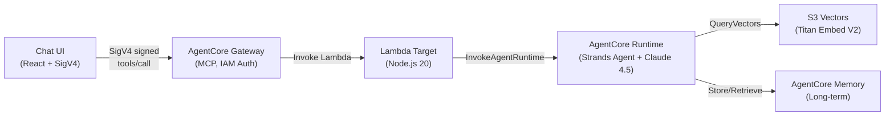
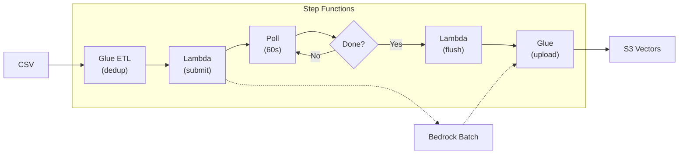

# Party Supply Chat Agent

A lightweight chat agent built with Amazon Bedrock AgentCore using Claude Sonnet 4.5 in us-west-2. Uses the Strands Agents SDK, AgentCore Gateway with IAM auth, S3 Vectors RAG, and long-term memory.

## Architecture

### Chat Flow


### Batch Import Flow (100K+ records)


**Key features:**
- Step Functions orchestrates the entire pipeline
- Automatic deduplication via Glue ETL (PySpark)
- Parallel Bedrock Batch jobs for embeddings (50% cost savings)
- Parallel Glue uploads (up to 10 concurrent)
- ~25 min for 123K products end-to-end

## Prerequisites

- AWS Account with credentials configured
- AWS CLI v2 ([Install Guide](https://docs.aws.amazon.com/cli/latest/userguide/getting-started-install.html))
- Node.js 20+ and npm 9+
- Docker (local testing only; CodeBuild handles remote builds)
- AgentCore CLI: `npm install -g @aws/agentcore`

> **Note:** npm deprecation warnings (e.g., `glob@10.5.0`) from `@aws/agentcore` are suppressed via `.npmrc` and do not affect functionality.

### AWS Credentials

1. Sign into the [AWS Console](https://console.aws.amazon.com/) with a role that has the [required permissions](docs/iam-policy.json).
2. Run `aws login` — it picks up your active console session.

```bash
aws login
aws sts get-caller-identity
```

### Model Access

Enable in the [Bedrock console](https://console.aws.amazon.com/bedrock/) (us-west-2):

| Model | ID |
|-------|----|
| Claude Sonnet 4.5 | `us.anthropic.claude-sonnet-4-5-20250929-v1:0` |
| Titan Text Embeddings V2 | `amazon.titan-embed-text-v2:0` |

## Quick Start

```bash
# 1. Install
npm install && cd agent && npm install && cd ../chat-ui && npm install && cd ..

# 2. Login
aws login && export AWS_REGION=us-west-2

# 3. Deploy agent + gateway
./scripts/deploy.sh --all

# 4. Deploy batch import infrastructure (one-time)
./scripts/deploy.sh --batch-async

# 5. Import your data (products + customers)
./scripts/batch-import.sh -p uploads/products.csv -c uploads/customers.csv --mode replace

# 6. Monitor import progress
./scripts/batch-status.sh

# 7. Run UI
./scripts/run-local-ui.sh --port 3000
```

> **Windows users:** Run all scripts using Git Bash or WSL, not PowerShell directly.

The deploy script handles agent runtime, gateway, Lambda, and S3 Vectors setup. The batch import pipeline uses Step Functions to orchestrate Glue ETL, Bedrock Batch inference, and vector uploads.

## Scripts

| Script | Purpose |
|--------|---------|
| `./scripts/deploy.sh --all` | Full deployment |
| `./scripts/deploy.sh --agent` | Deploy agent + gateway + memory only |
| `./scripts/deploy.sh --lambda --gateway-target` | Redeploy Lambda + rewire |
| `./scripts/deploy.sh --batch-async` | Deploy batch processing infrastructure (CDK) |
| `./scripts/deploy.sh --status` | Show status + update UI config |
| `./scripts/import-csv.sh` | Import customer CSV data (see below) |
| `./scripts/batch-import.sh` | Batch import for large datasets (100K+) |
| `./scripts/batch-status.sh` | Check batch job status and vector counts |
| `./scripts/flush-indexes.sh` | Clear S3 Vector indexes |
| `./scripts/run-local-ui.sh` | Start chat UI locally |
| `./scripts/cleanup.sh` | Tear down all resources (correct order) |

Run `./scripts/deploy.sh --help` for all switches.

## Guardrails

The agent includes Bedrock Guardrails for content filtering and safety. Guardrails are deployed automatically with the AgentCore CDK stack.

### What's Protected

| Category | Setting | Description |
|----------|---------|-------------|
| Content Filters | HATE, VIOLENCE, SEXUAL, MISCONDUCT | HIGH strength blocking |
| Content Filters | INSULTS | MEDIUM strength blocking |
| Denied Topics | Competitors | Blocks recommendations for competitor stores |
| Denied Topics | Politics | Blocks political discussions |
| Denied Topics | Medical/Legal Advice | Blocks liability-prone advice |
| PII Protection | Credit cards, SSN, bank info | BLOCKED |
| PII Protection | Email, phone, name, address | ANONYMIZED |

**Note:** Religious content is NOT blocked since party supplies include religious occasions (Christmas, Hanukkah, Easter, Diwali, Eid, etc.).

### Configuration

Guardrails are automatically configured by the deploy script. When you run `./scripts/deploy.sh --agent`:

1. The CDK stack creates the Bedrock Guardrail
2. The script reads the guardrail ID and version from CloudFormation outputs
3. It updates `agentcore/agentcore.json` with the `GUARDRAIL_ID` and `GUARDRAIL_VERSION` environment variables
4. It redeploys the agent with the guardrail configuration
5. It adds `bedrock:ApplyGuardrail` permission to the runtime role

No manual configuration is required.

## Importing Customer Data

The agent supports importing your own product catalog and customer profiles from CSV files. This enables personalized recommendations based on customer preferences, purchase history, and segmentation.

### CSV Formats

**Products CSV** - Your product catalog with fields like:
```
ITEM_ID,TITLE,DESCRIPTION,PRICE,AVAILABILITY,CATEGORY_L1,CATEGORY_L2,THEME,COLOR,...
```

**Customers CSV** - Customer profiles for personalization:
```
USER_ID,CUSTOMER_TYPE,CUSTOMER_SEGMENT,PREFERRED_THEME,PRICE_AFFINITY,LIFETIME_SPEND,...
```

See [`scripts/import-csv-data.ts`](scripts/import-csv-data.ts) for the full list of supported fields.

### Import Workflow

```bash
# Step 1: Convert CSV to JSON only
./scripts/import-csv.sh -p products.csv -c customers.csv

# Step 2: Convert + generate embeddings
./scripts/import-csv.sh -p products.csv -c customers.csv -g

# Step 3: Full pipeline - CSV → JSON → Embeddings → Upload to S3 Vectors
./scripts/import-csv.sh -p products.csv -c customers.csv -g -u
```

| Flag | Description |
|------|-------------|
| `-p, --products <file>` | Path to products CSV file |
| `-c, --customers <file>` | Path to customers CSV file |
| `-o, --output <dir>` | Output directory (default: `./seed-data`) |
| `-g, --generate` | Generate embeddings using Amazon Titan |
| `-u, --upload` | Upload vectors to S3 Vectors (requires `-g`) |
| `--mode <mode>` | Upload mode: `upsert` (default), `replace`, `append` |
| `--region <region>` | AWS region (default: us-west-2) |

### Upload Modes

| Mode | Behavior |
|------|----------|
| `upsert` | Update existing keys, add new keys, keep others (default) |
| `replace` | Delete and recreate indexes, then insert fresh data |
| `append` | Only insert new keys, skip existing ones |

```bash
# Replace all existing data with new CSV data
./scripts/import-csv.sh -p products.csv -c customers.csv -g -u --mode replace
```

### Large Dataset Import (Batch Inference)

For large datasets (100K+ items), use Bedrock Batch Inference instead of the standard import. This runs asynchronously in AWS with 50% cost savings.

#### One-Time Setup

Deploy the batch processing infrastructure via CDK:

```bash
export AWS_REGION=us-west-2
./scripts/deploy.sh --batch-async
```

This creates (via CDK):
- **Step Functions state machine** for orchestrating the entire pipeline
- **S3 bucket** for batch job I/O
- **Glue ETL job** (PySpark) for deduplication and JSONL preparation
- **Glue Python Shell job** for uploading vectors to S3 Vectors
- **Lambda functions** for submitting batch jobs, checking status, and flushing indexes
- **IAM roles** for Glue, Lambda, and Bedrock Batch Inference

#### Running Batch Imports

```bash
# Import products
./scripts/batch-import.sh -p uploads/products.csv --mode replace

# Import customers
./scripts/batch-import.sh -c uploads/customers.csv --mode replace

# Check status
./scripts/batch-status.sh

# Check vector index counts
./scripts/batch-status.sh --vectors
```

| Flag | Description |
|------|-------------|
| `-p, --products <file>` | Path to products CSV file |
| `-c, --customers <file>` | Path to customers CSV file |
| `--mode <mode>` | Upload mode: `upsert` (default), `replace`, `append` |
| `--region <region>` | AWS region (default: us-west-2) |

**Estimated times:**
- 5K customers: ~17 minutes
- 123K products: ~25 minutes

#### Step Functions Orchestration

The entire pipeline is orchestrated by AWS Step Functions:

```
1. Glue ETL (PySpark dedup → JSONL chunks)
    ↓
2. Lambda (submit Bedrock Batch jobs)
    ↓
3. Poll loop (check job status every 60s)
    ↓
4. Lambda (flush index for replace mode)
    ↓
5. Glue Python Shell (upload vectors to S3 Vectors)
```

**Concurrency:**
- Multiple imports can run in parallel (products + customers)
- Glue jobs support up to 10 concurrent runs
- Glue upload jobs run in parallel (up to 3 per import)

#### Data Anonymization

To anonymize customer data before importing:

```bash
# Anonymize products (replaces company names, URLs)
npx tsx scripts/anonymize-csv.ts -i uploads/products.csv -o uploads/products-anon.csv

# Anonymize customers (hashes user IDs, generalizes regions)
npx tsx scripts/anonymize-csv.ts -i uploads/customers.csv -o uploads/customers-anon.csv --type customers
```

### Customer Personalization

When a `userId` is passed in the chat request, the agent automatically:
1. Looks up the customer profile from S3 Vectors
2. Injects preferences (theme, category, price affinity) into the system prompt
3. Personalizes recommendations based on the profile

If `userId` is not provided or the profile doesn't exist, the agent continues normally without personalization - no errors or interruptions.

**Example request with userId:**
```json
{
  "prompt": "Show me party supplies for a birthday",
  "userId": "93107547"
}
```

## Project Structure

```
.
├── agent/                    # Strands Agent (TypeScript)
│   ├── agent.ts              # Agent with RAG + memory tools
│   ├── tools/
│   │   ├── rag-search.ts     # S3 Vectors search
│   │   └── memory.ts         # AgentCore Memory integration
│   └── Dockerfile
├── lambda/                   # Gateway Lambda Target
│   ├── index.mjs             # Invokes AgentCore Runtime
│   └── tools.json            # MCP tool schema
├── chat-ui/                  # React Chat UI
│   └── src/
│       ├── components/ChatWindow.tsx
│       └── lib/sigv4.ts
├── scripts/
│   ├── deploy.sh             # Main deployment (includes --batch-async)
│   ├── cleanup.sh
│   ├── run-local-ui.sh
│   ├── import-csv.sh         # Standard CSV import (small datasets)
│   ├── import-csv-data.ts    # CSV to JSON converter
│   ├── generate-seed-data.ts # Generate embeddings
│   ├── batch-import.sh       # Batch import for large datasets (100K+)
│   ├── batch-status.sh       # Check Step Function execution status
│   ├── batch-prepare.ts      # CSV to JSONL with deduplication
│   ├── anonymize-csv.ts      # Anonymize sensitive data
│   └── batch-result-lambda/  # Lambda functions for batch pipeline
│       ├── submit-batch.mjs  # Submits Bedrock Batch jobs
│       ├── check-jobs.mjs    # Checks batch job status
│       └── flush-index.mjs   # Flushes S3 Vectors index (replace mode)
├── glue-jobs/                # Glue jobs for production batch processing
│   ├── dedup-prepare.py      # PySpark ETL: deduplication + JSONL prep
│   └── upload-vectors.py     # Python Shell: upload to S3 Vectors
├── batch-cdk/                # CDK stack for batch infrastructure
│   ├── bin/app.ts            # CDK app entry point
│   └── lib/batch-processing-stack.ts  # Stack definition
├── docs/
│   ├── iam-policy.json       # Least-privilege IAM policy
│   ├── adding-tools.md       # Guide: adding new tools
│   └── tech-features.md      # Technical details & gotchas
└── agentcore/
    └── agentcore.json        # Runtime + Gateway + Memory spec
```

## Documentation

| Doc | Description |
|-----|-------------|
| [`docs/iam-policy.json`](docs/iam-policy.json) | Least-privilege IAM policy (replace `YOUR_ACCOUNT_ID` / `YOUR_REGION`) |
| [`docs/adding-tools.md`](docs/adding-tools.md) | Step-by-step guide for adding new tools to the agent |
| [`docs/tech-features.md`](docs/tech-features.md) | Technical details: memory, RAG, SDK workarounds, gotchas |

## Cleanup

```bash
./scripts/cleanup.sh
```

Deletes in order: gateway targets → gateway → Lambda → IAM role → Memory → ECR → CloudFormation stack → S3 Vectors → local artifacts.
