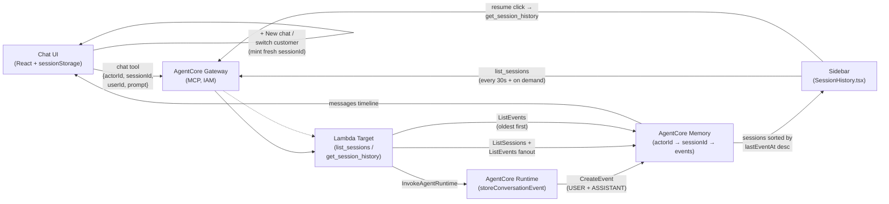
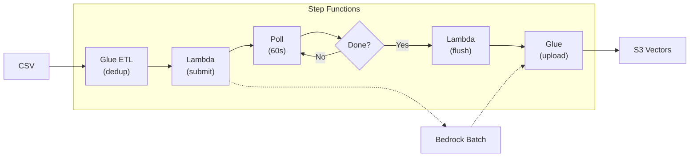

# Party Supply Chat Agent

A lightweight chat agent built with Amazon Bedrock AgentCore using Claude Sonnet 4.5 in us-west-2. Uses the Strands Agents SDK, AgentCore Gateway with IAM auth, S3 Vectors RAG, and long-term memory.

## Architecture

### Chat Flow


### Session Management & History

How the UI's "Recent (48h)" sidebar, "+ New chat" button, and per-customer threads are wired up — all backed by **AgentCore Memory** as the single source of truth (no separate session store):



Behavior summary:

- **Session lifecycle** — UI mints `sessionId` lazily; AgentCore Memory creates the session record on the first `CreateEvent`. Switching customer or clicking **+ New chat** rotates the sessionId, so each thread is isolated per actor.
- **Sidebar refresh** — three triggers: (1) actorId change, (2) `+ New chat` / post-send nudge, (3) silent 30s background poll. Configurable via `VITE_HISTORY_WINDOW_HOURS` and `VITE_HISTORY_POLL_SECONDS`.
- **`lastEventAt` filtering** — `list_sessions` derives `lastEventAt` from per-session `ListEvents`, then filters by `lastEventAt >= sinceMs`. A reused sessionId with fresh activity surfaces correctly even when its `createdAt` is days old.
- **Credential expiry** — UI tracks `expiresAt` (from `aws configure export-credentials`) and 60s-polls for expiry; STS/SigV4 401/403s reroute the user to the credentials form rather than failing silently.

### Batch Import Flow (100K+ records)


**Key features:**
- Step Functions orchestrates the entire pipeline
- Automatic deduplication via Glue ETL (PySpark)
- Parallel Bedrock Batch jobs for embeddings (50% cost savings)
- Parallel Glue uploads (up to 10 concurrent)
- ~25 min for 123K products end-to-end

### Recommendation Engine

Three dedicated tools handle product recommendations:

| Tool | When the agent picks it |
|---|---|
| `recommend_products` | Customer describes an event with criteria (theme, occasion, budget, guest count). Over-fetches candidates, filters out-of-stock, re-ranks by customer profile. |
| `personalized_search` | Free-text search where the customer is known. Adds profile signal at re-rank time. |
| `recommend_for_customer` | Known customer asks "what should I buy?" with no event context. Pure profile-driven. |
| `search_products` | Anonymous keyword search (fallback). |

The agent always returns a structured JSON response envelope (`type`, `message`, optional `recommendations`, optional `followups`) which the UI parses into product cards (with title, price, image, link) plus optional refinement chips. See [`agent/response-envelope.ts`](agent/response-envelope.ts) for the schema.

### Behavioral Data (User Interactions)

The agent can also reason over a user-item event log (views, add-to-cart, purchases). Each row of an interactions CSV becomes one vector in `interactions-index`:

```csv
USER_ID,ITEM_ID,TIMESTAMP,EVENT_TYPE,EVENT_VALUE,QUANTITY,PRICE,RECOMMENDATION_ID
CUST-100042,PROD-0001234,1777423645,add_to_cart,2.0,1,3.97,
CUST-100128,PROD-0009876,1777421241,purchase,5.0,1,8.79,
CUST-100599,PROD-0050321,1777423969,view,1.0,0,5.07,Recently Viewed
```

| Tool | When the agent picks it |
|---|---|
| `query_interactions` | Behavioral questions: "what have I been browsing", "items I added to cart but didn't buy", "show me recent views by user X". Returns event records (userId, itemId, eventType, timestamp, price). |

The agent typically pairs `query_interactions` (returns IDs) with `search_products` (enriches them with title/price/link/image cards), e.g., for a "what items did I add to cart this week" query.

#### Generating fixtures

The bulk fixture generator produces interactions that reference real IDs from the products and customers files, so the data stays coherent end-to-end:

```bash
npx tsx scripts/generate-bulk-csv.ts
# Writes: 100K products, 5K customers, 25K interactions, 500 sample interactions
```

| File | Rows | Purpose |
|---|---|---|
| `uploads/sample-products.csv` / `sample-customers.csv` / `sample-interactions.csv` | 10 / 10 / 500 | Tiny fixture, useful for smoke tests |
| `uploads/products.csv` / `customers.csv` / `interactions.csv` | 100K / 5K / 25K | Bulk import (regenerable, gitignored) |

Sizes are configurable: `npx tsx scripts/generate-bulk-csv.ts --interactions 50000 --sample-interactions 1000`

#### Importing

```bash
./scripts/batch-import.sh -i uploads/interactions.csv --mode replace
```

Same Step Functions pipeline as products/customers: dedup (by `user+item+timestamp` composite key) → embed via Bedrock Batch → upload to S3 Vectors. 25K events finishes in ~10 min.

### Customer Selector (UI)

The chat UI has a **customer selector** in the top-right toolbar. When you pick a customer, every subsequent chat request loads that customer's profile and last 10 interactions and injects them into the agent's system prompt - so the agent answers as if it knows who you are without you having to tell it.

How it works:

1. The selector fetches the full list once via the gateway's `list_customers` MCP tool (Lambda → S3 Vectors `ListVectors`). ~5K customers loads in ~500ms.
2. Type-ahead filters across `userId`, segment, region, and preferred theme - all client-side, no extra calls.
3. Picking a customer fires a system message ("Now chatting as **CUST-XXX**...") and persists the selection in `sessionStorage` so a page reload keeps it active.
4. Each chat request now sends `userId` alongside the prompt. The agent runtime loads the profile + recent interactions in parallel with catalog facets (~300-500ms total) and renders them into the `PROFILE_BLOCK` section of the system prompt via the `{{PROFILE_CONTEXT}}`, `{{PROFILE_TIPS}}`, and `{{INTERACTION_HISTORY}}` placeholders.
5. Click **Clear** in the selector to remove personalization for the rest of the session.

The selector requires the Lambda to be redeployed (it gets a new `list_customers` tool handler and an extra IAM policy for `s3vectors:ListVectors`) and the gateway to re-register both tools:

```bash
./scripts/deploy.sh --lambda --gateway-target
```

### Recent Conversations Sidebar (UI)

The left side of the chat shows the **last 48 hours of conversations** for the currently selected customer, with each session's opening prompt as a one-line preview. Click any entry to **resume** that conversation - the chat re-hydrates from the past timeline and new messages continue the same thread.

Backed by **AgentCore Memory** directly - no separate database. Two new MCP tools sit on the gateway Lambda:

| Tool | What it does |
|---|---|
| `list_sessions` | Wraps `bedrock-agentcore:ListSessions` for the actor, collects a pool of recent sessions, then fan-outs `ListEvents` per session to derive both the first user prompt and `lastEventAt`. Filters by `lastEventAt >= sinceMs` (so reused sessionIds with fresh activity still surface) and sorts newest-first by last activity. ~500ms for 20 sessions. |
| `get_session_history` | Wraps `bedrock-agentcore:ListEvents` for a single session, sorts oldest-first, and returns `[{role, content, timestamp}]` so the UI can re-hydrate the chat. |

How it fits together:

1. Pick a customer in the toolbar. The sidebar re-fetches for that actor.
2. See the list of sessions newest-first with relative timestamps ("2h ago", "1d ago").
3. Click an entry. The UI swaps `sessionId` and replaces the message list with the past timeline (system banner: *"Resumed past conversation (8 messages)..."*). Any new message you send continues that thread because AgentCore Memory keys events on `sessionId`.
4. The currently active session is highlighted with a `current` tag and disabled.

Sidebar auto-refreshes:
- **+ New chat** button (next to the customer dropdown) → mints a fresh `sessionId`, clears the message pane, and immediately reloads the sidebar.
- **After every successful send** → the sidebar reloads so a brand-new session pops in without waiting for the next poll.
- **Background polling** every 30 seconds (silent — no loading flicker) keeps the list fresh even when you're idle.

#### Configurable sidebar behavior

Two Vite env vars let you tune the sidebar without touching code. Add them to `chat-ui/.env.local`:

| Var | Default | Effect |
|---|---|---|
| `VITE_HISTORY_WINDOW_HOURS` | `48` | Lookback window. The header label and empty-state copy auto-derive (e.g. `Recent (7d)` when set to `168`). |
| `VITE_HISTORY_POLL_SECONDS` | `30` | Background poll cadence. Set to `0` to disable polling entirely — the manual refresh chip and the post-send nudge still work. |

```bash
# chat-ui/.env.local
VITE_HISTORY_WINDOW_HOURS=168     # show a week of sessions
VITE_HISTORY_POLL_SECONDS=15      # poll twice as often
```

Things to know:
- Past sessions render as **plain prose** - product cards and chips aren't recoverable since AgentCore Memory only stores the textual payload, not the envelope metadata.
- The sidebar is hidden on screens narrower than 720px (the chat takes full width on mobile).
- AgentCore Memory auto-deletes empty sessions after 1 day; populated short-term events expire on the memory's `eventExpiryDuration` schedule (default 30 days).

The Lambda needs `bedrock-agentcore:ListSessions` and `bedrock-agentcore:ListEvents` IAM permissions plus a `MEMORY_ID` env var. Both are wired automatically by `./scripts/deploy.sh --lambda --gateway-target`.

#### Calling from any MCP client

Both tools are part of the standard MCP `toolSchema` on the gateway target, so they're not browser-only — anything that can speak MCP-over-HTTPS with SigV4 (Claude Desktop, a downstream agent, your own Node/Python/Go code) can list and resume sessions through the same gateway URL.

Two runnable examples live alongside this repo:

| Example | Use case |
|---|---|
| [examples/nodejs-client/](examples/nodejs-client/) | Local CLI / Node script — uses a user's AWS profile via the default credential chain. Good for testing and embedding in a React app. |
| [examples/lambda-mcp-client/](examples/lambda-mcp-client/) | AWS Lambda (Node.js 24.x) — uses the execution-role credentials. Good for embedding into Step Functions, API Gateway, EventBridge workflows. Ships with a one-command `deploy.sh`. |

```bash
# Local Node CLI
export AGENTCORE_GATEWAY_URL="https://your-gateway.gateway.bedrock-agentcore.us-west-2.amazonaws.com"
cd examples/nodejs-client && npm install
node session-history.js list   CUST-100005
node session-history.js resume CUST-100005 session-1780951267383-7bm7iut

# Lambda (auto-detects gateway URL, creates IAM role, deploys on nodejs24.x)
cd examples/lambda-mcp-client && ./deploy.sh
aws lambda invoke --function-name agentcore-lambda-example --region us-west-2 \
  --cli-binary-format raw-in-base64-out \
  --payload '{"action":"list_sessions","actorId":"CUST-100005"}' /tmp/out.json && cat /tmp/out.json
```

See each example's README for the full walkthrough including programmatic snippets, IAM requirements, and the JSON shapes each tool returns.

### Prompt Management

System prompts live in [`agent/prompts.md`](agent/prompts.md) and are uploaded to a DynamoDB table on deploy. The runtime polls the table every 60 seconds, so you can edit prompts and push updates **without rebuilding the agent container**:

```bash
# Edit agent/prompts.md, then:
./scripts/deploy.sh --prompts    # ~5 seconds, live in <=60s
```

`--prompts` also bumps a `_meta.cacheBust` sentinel in the same table. The runtime watches that value, so on the next poll it **also refreshes the catalog-facet cache** — meaning newly imported themes, occasions, and categories show up in chip suggestions automatically. Re-run `--prompts` after a batch import to pick them up:

```bash
./scripts/batch-import.sh -p uploads/products.csv -c uploads/customers.csv --mode replace
./scripts/deploy.sh --prompts    # signals the runtime to re-sample the catalog
```

See [docs/customization.md](docs/customization.md) for details on customizing personas, tools, and recommendation behavior.

### Performance Optimizations

- **LRU embedding cache** — repeated queries (chip submissions, common themes) skip the Titan API call entirely (-150-300ms each)
- **Parallel profile + vector search** — recommendation tools fetch the customer profile and run the vector query simultaneously (-300-500ms when personalized)
- **Lambda warm-up** — EventBridge pings the gateway Lambda every 5 minutes so first requests don't pay cold start cost (-1-2s on idle)
- **Catalog facet cache** — themes/occasions/categories are sampled once at runtime startup and used to populate refinement chips with values that actually exist in the catalog

## Prerequisites

- AWS Account with credentials configured
- AWS CLI v2 ([Install Guide](https://docs.aws.amazon.com/cli/latest/userguide/getting-started-install.html))
- Node.js 22+ and npm 10+ (Node 20 reached EOL on 2026-04-30)
- Docker (local testing only; CodeBuild handles remote builds)
- AgentCore CLI: `npm install -g @aws/agentcore`
- A POSIX shell (Git Bash, WSL, or any Linux/macOS shell) — PowerShell is not supported
- `zip` or `7-Zip` for Lambda packaging
- `jq` for JSON parsing in deploy/cleanup scripts

> **Note:** npm deprecation warnings (e.g., `glob@10.5.0`) from `@aws/agentcore` are suppressed via `.npmrc` and do not affect functionality.

### Windows Setup

All scripts assume a POSIX environment. On Windows, run them from **Git Bash** or **WSL2**, not PowerShell or `cmd.exe`. After installing Git for Windows you'll get Git Bash automatically.

You'll also need three command-line tools that aren't bundled with Git Bash. The cleanest way is via [Chocolatey](https://chocolatey.org/install) (a package manager for Windows). Open an **elevated PowerShell** once to install Chocolatey, then everything else can be done from Git Bash:

```bash
# Install jq (used by deploy.sh / batch-status.sh / troubleshoot.sh for JSON parsing)
choco install jq -y

# Install 7-Zip (used by deploy.sh as the zip backend on Windows)
choco install 7zip -y
```

After install, open a **new Git Bash window** so PATH picks up the new binaries. Verify:

```bash
jq --version    # should print jq-1.x
7z              # should print "7-Zip ..."
```

The deploy script's [`create_zip` helper](scripts/deploy.sh#L150) auto-detects 7-Zip even when no `zip` command exists. If you (or a teammate) have already created an alias or symlink that maps `zip` to 7-Zip, the helper will detect that too via the banner string and route to 7-Zip syntax automatically — no extra setup required.

If Chocolatey isn't installed, install it first ([install instructions](https://chocolatey.org/install)) — it's the most reliable package manager on Windows Server / older Windows builds where winget often isn't available.

If you can't install Chocolatey at all, manual installs work:

| Tool | Manual install |
|---|---|
| 7-Zip | Download from [7-zip.org/download.html](https://7-zip.org/download.html) and use defaults (installs to `C:\Program Files\7-Zip\`) |
| jq | Download `jq.exe` from [jqlang.github.io/jq](https://jqlang.github.io/jq/download/), rename to `jq.exe`, and place anywhere on PATH |

The deploy script also looks for `7z.exe` at `C:\Program Files\7-Zip\` and `C:\Program Files (x86)\7-Zip\` as fallbacks, so a default 7-Zip install works without any PATH manipulation.

### AWS Credentials

1. Sign into the [AWS Console](https://console.aws.amazon.com/) with a role that has the [required permissions](docs/iam-policy.json).
2. Run `aws login` — it picks up your active console session.

```bash
aws login
aws sts get-caller-identity
```

### Model Access

Enable in the [Bedrock console](https://console.aws.amazon.com/bedrock/) (us-west-2):

| Model | ID |
|-------|----|
| Claude Sonnet 4.5 | `us.anthropic.claude-sonnet-4-5-20250929-v1:0` |
| Titan Text Embeddings V2 | `amazon.titan-embed-text-v2:0` |

## Quick Start

```bash
# 1. Install
npm install && cd agent && npm install && cd ../chat-ui && npm install && cd ..

# 2. Login
aws login && export AWS_REGION=us-west-2

# 3. Deploy agent + gateway (also seeds 20 products, 10 customers, 10 orders, 50 interactions)
./scripts/deploy.sh --all

# 4. Deploy batch import infrastructure (one-time, only needed for bulk CSV imports)
./scripts/deploy.sh --batch-async

# 5. (Optional) Generate bulk fixtures - 100K products, 5K customers, 25K interactions
npx tsx scripts/generate-bulk-csv.ts

# 6. (Optional) Bulk-import your own catalog + behavioral data
./scripts/batch-import.sh \
  -p uploads/products.csv \
  -c uploads/customers.csv \
  -i uploads/interactions.csv \
  --mode replace

# 7. Monitor import progress
./scripts/batch-status.sh

# 8. Run UI
./scripts/run-local-ui.sh --port 3000
```

> **Windows users:** Run all scripts using Git Bash or WSL, not PowerShell directly.

The deploy script handles agent runtime, gateway, Lambda, and S3 Vectors setup, and seeds a small synthetic catalog so you can chat immediately. The optional batch import pipeline uses Step Functions (Glue ETL → Bedrock Batch → vector upload) for production-sized data — pass any combination of `-p` / `-c` / `-i` depending on what you want to import.

## Scripts

| Script | Purpose |
|--------|---------|
| `./scripts/deploy.sh --all` | Full deployment |
| `./scripts/deploy.sh --agent` | Deploy agent + gateway + memory only |
| `./scripts/deploy.sh --prompts` | **Update prompts only** (no agent rebuild, live in <=60s) |
| `./scripts/deploy.sh --lambda --gateway-target` | Redeploy Lambda + rewire |
| `./scripts/deploy.sh --batch-async` | Deploy batch processing infrastructure (CDK) |
| `./scripts/deploy.sh --guardrail` | Update Bedrock Guardrail config |
| `./scripts/deploy.sh --status` | Show status + update UI config |
| `./scripts/import-csv.sh` | Import customer CSV data (see below) |
| `./scripts/batch-import.sh` | Batch import for large datasets (100K+) |
| `./scripts/batch-status.sh` | Check batch job status and vector counts |
| `./scripts/flush-indexes.sh` | Clear S3 Vector indexes |
| `./scripts/run-local-ui.sh` | Start chat UI locally |
| `./scripts/cleanup.sh` | Tear down all resources (correct order) |

Run `./scripts/deploy.sh --help` for all switches.

### Customization

The agent's system prompt lives in [`agent/prompts.md`](agent/prompts.md). Edit it and run `./scripts/deploy.sh --prompts` for live updates in 60 seconds. See [docs/customization.md](docs/customization.md) for the full guide on tuning persona, tool selection, and recommendation behavior.

## Guardrails

The agent includes Bedrock Guardrails for content filtering and safety. Guardrails are deployed automatically with the AgentCore CDK stack.

### What's Protected

| Category | Setting | Description |
|----------|---------|-------------|
| Content Filters | HATE | HIGH strength blocking |
| Content Filters | INSULTS, SEXUAL, VIOLENCE, MISCONDUCT | LOW strength blocking |
| Denied Topics | Competitors | Blocks recommendations for competitor stores |
| Denied Topics | Politics | Blocks political discussions |
| Denied Topics | Medical/Legal Advice | Blocks liability-prone advice |
| PII Protection | Credit cards, SSN, bank info | BLOCKED |
| PII Protection | Email, phone, name, address | ANONYMIZED |

**Note:** Religious content is NOT blocked since party supplies include religious occasions (Christmas, Hanukkah, Easter, Diwali, Eid, etc.). Most filters are tuned to LOW because Bedrock's pretrained classifiers false-positive on legitimate party-supply terms (e.g., bachelor party, "toddler birthday") at MEDIUM and above. HATE stays HIGH.

If a streaming response gets cut off mid-token, the runtime detects the guardrail intervention and replaces the truncation with an actionable message (see [`agent/agent.ts`](agent/agent.ts) `buildEnvelope`). Block messages render as a styled error banner in the UI rather than as garbled text.

### Configuration

Guardrails are automatically configured by the deploy script. When you run `./scripts/deploy.sh --agent`:

1. The CDK stack creates the Bedrock Guardrail
2. The script reads the guardrail ID and version from CloudFormation outputs
3. It updates `agentcore/agentcore.json` with the `GUARDRAIL_ID` and `GUARDRAIL_VERSION` environment variables
4. It redeploys the agent with the guardrail configuration
5. It adds `bedrock:ApplyGuardrail` permission to the runtime role

No manual configuration is required.

## Importing Customer Data

The agent supports importing your own product catalog and customer profiles from CSV files. This enables personalized recommendations based on customer preferences, purchase history, and segmentation.

### CSV Formats

**Products CSV** - Your product catalog with fields like:
```
ITEM_ID,TITLE,DESCRIPTION,PRICE,AVAILABILITY,CATEGORY_L1,CATEGORY_L2,THEME,COLOR,...
```

**Customers CSV** - Customer profiles for personalization:
```
USER_ID,CUSTOMER_TYPE,CUSTOMER_SEGMENT,PREFERRED_THEME,PRICE_AFFINITY,LIFETIME_SPEND,...
```

See [`scripts/import-csv-data.ts`](scripts/import-csv-data.ts) for the full list of supported fields.

### Import Workflow

```bash
# Step 1: Convert CSV to JSON only
./scripts/import-csv.sh -p products.csv -c customers.csv

# Step 2: Convert + generate embeddings
./scripts/import-csv.sh -p products.csv -c customers.csv -g

# Step 3: Full pipeline - CSV → JSON → Embeddings → Upload to S3 Vectors
./scripts/import-csv.sh -p products.csv -c customers.csv -g -u
```

| Flag | Description |
|------|-------------|
| `-p, --products <file>` | Path to products CSV file |
| `-c, --customers <file>` | Path to customers CSV file |
| `-o, --output <dir>` | Output directory (default: `./seed-data`) |
| `-g, --generate` | Generate embeddings using Amazon Titan |
| `-u, --upload` | Upload vectors to S3 Vectors (requires `-g`) |
| `--mode <mode>` | Upload mode: `upsert` (default), `replace`, `append` |
| `--region <region>` | AWS region (default: us-west-2) |

### Upload Modes

| Mode | Behavior |
|------|----------|
| `upsert` | Update existing keys, add new keys, keep others (default) |
| `replace` | Delete and recreate indexes, then insert fresh data |
| `append` | Only insert new keys, skip existing ones |

```bash
# Replace all existing data with new CSV data
./scripts/import-csv.sh -p products.csv -c customers.csv -g -u --mode replace
```

### Large Dataset Import (Batch Inference)

For large datasets (100K+ items), use Bedrock Batch Inference instead of the standard import. This runs asynchronously in AWS with 50% cost savings.

#### One-Time Setup

Deploy the batch processing infrastructure via CDK:

```bash
export AWS_REGION=us-west-2
./scripts/deploy.sh --batch-async
```

This creates (via CDK):
- **Step Functions state machine** for orchestrating the entire pipeline
- **S3 bucket** for batch job I/O
- **Glue ETL job** (PySpark) for deduplication and JSONL preparation
- **Glue Python Shell job** for uploading vectors to S3 Vectors
- **Lambda functions** for submitting batch jobs, checking status, and flushing indexes
- **IAM roles** for Glue, Lambda, and Bedrock Batch Inference

#### Running Batch Imports

```bash
# Import products
./scripts/batch-import.sh -p uploads/products.csv --mode replace

# Import customers
./scripts/batch-import.sh -c uploads/customers.csv --mode replace

# Check status
./scripts/batch-status.sh

# Check vector index counts
./scripts/batch-status.sh --vectors
```

| Flag | Description |
|------|-------------|
| `-p, --products <file>` | Path to products CSV file |
| `-c, --customers <file>` | Path to customers CSV file |
| `--mode <mode>` | Upload mode: `upsert` (default), `replace`, `append` |
| `--region <region>` | AWS region (default: us-west-2) |

**Estimated times:**
- 5K customers: ~17 minutes
- 123K products: ~25 minutes

#### Step Functions Orchestration

The entire pipeline is orchestrated by AWS Step Functions:

```
1. Glue ETL (PySpark dedup → JSONL chunks)
    ↓
2. Lambda (submit Bedrock Batch jobs)
    ↓
3. Poll loop (check job status every 60s)
    ↓
4. Lambda (flush index for replace mode)
    ↓
5. Glue Python Shell (upload vectors to S3 Vectors)
```

**Concurrency:**
- Multiple imports can run in parallel (products + customers)
- Glue jobs support up to 10 concurrent runs
- Glue upload jobs run in parallel (up to 3 per import)

#### Data Anonymization

To anonymize customer data before importing:

```bash
# Anonymize products (replaces company names, URLs)
npx tsx scripts/anonymize-csv.ts -i uploads/products.csv -o uploads/products-anon.csv

# Anonymize customers (hashes user IDs, generalizes regions)
npx tsx scripts/anonymize-csv.ts -i uploads/customers.csv -o uploads/customers-anon.csv --type customers
```

### Customer Personalization

When a `userId` is passed in the chat request, the agent automatically:
1. Looks up the customer profile from S3 Vectors
2. Injects preferences (theme, category, price affinity) into the system prompt
3. Personalizes recommendations based on the profile

If `userId` is not provided or the profile doesn't exist, the agent continues normally without personalization - no errors or interruptions.

**Example request with userId:**
```json
{
  "prompt": "Show me party supplies for a birthday",
  "userId": "93107547"
}
```

## Project Structure

```
.
├── agent/                    # Strands Agent (TypeScript)
│   ├── agent.ts              # Agent with RAG + memory tools
│   ├── tools/
│   │   ├── rag-search.ts     # S3 Vectors search
│   │   └── memory.ts         # AgentCore Memory integration
│   └── Dockerfile
├── lambda/                   # Gateway Lambda Target
│   ├── index.mjs             # Invokes AgentCore Runtime
│   └── tools.json            # MCP tool schema
├── chat-ui/                  # React Chat UI
│   └── src/
│       ├── components/ChatWindow.tsx
│       └── lib/sigv4.ts
├── scripts/
│   ├── deploy.sh             # Main deployment (includes --batch-async)
│   ├── cleanup.sh
│   ├── run-local-ui.sh
│   ├── import-csv.sh         # Standard CSV import (small datasets)
│   ├── import-csv-data.ts    # CSV to JSON converter
│   ├── generate-seed-data.ts # Generate embeddings
│   ├── batch-import.sh       # Batch import for large datasets (100K+)
│   ├── batch-status.sh       # Check Step Function execution status
│   ├── batch-prepare.ts      # CSV to JSONL with deduplication
│   ├── anonymize-csv.ts      # Anonymize sensitive data
│   └── batch-result-lambda/  # Lambda functions for batch pipeline
│       ├── submit-batch.mjs  # Submits Bedrock Batch jobs
│       ├── check-jobs.mjs    # Checks batch job status
│       └── flush-index.mjs   # Flushes S3 Vectors index (replace mode)
├── glue-jobs/                # Glue jobs for production batch processing
│   ├── dedup-prepare.py      # PySpark ETL: deduplication + JSONL prep
│   └── upload-vectors.py     # Python Shell: upload to S3 Vectors
├── batch-cdk/                # CDK stack for batch infrastructure
│   ├── bin/app.ts            # CDK app entry point
│   └── lib/batch-processing-stack.ts  # Stack definition
├── docs/
│   ├── iam-policy.json       # Least-privilege IAM policy
│   ├── adding-tools.md       # Guide: adding new tools
│   └── tech-features.md      # Technical details & gotchas
└── agentcore/
    └── agentcore.json        # Runtime + Gateway + Memory spec
```

## Documentation

| Doc | Description |
|-----|-------------|
| [`docs/iam-policy.json`](docs/iam-policy.json) | Least-privilege IAM policy (replace `YOUR_ACCOUNT_ID` / `YOUR_REGION`) |
| [`docs/customization.md`](docs/customization.md) | Edit prompts, persona, recommendation flow, chip categories, guardrail (no rebuild) |
| [`docs/path-to-production.md`](docs/path-to-production.md) | Going from dev deploy to prod: accounts, CI/CD, data pipeline, observability, security |
| [`docs/adding-tools.md`](docs/adding-tools.md) | Step-by-step guide for adding new tools to the agent |
| [`docs/tech-features.md`](docs/tech-features.md) | Technical details: memory, RAG, SDK workarounds, gotchas |

## Cleanup

```bash
./scripts/cleanup.sh
```

Deletes in order: gateway targets → gateway → Lambda → IAM role → Memory → ECR → CloudFormation stack → S3 Vectors → local artifacts.
