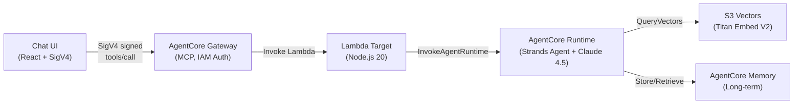

# Party Supply Chat Agent

A lightweight chat agent built with Amazon Bedrock AgentCore using Claude Sonnet 4.5 in us-west-2. Uses the Strands Agents SDK, AgentCore Gateway with IAM auth, S3 Vectors RAG, and long-term memory.

## Architecture



## Prerequisites

- AWS Account with credentials configured
- AWS CLI v2 ([Install Guide](https://docs.aws.amazon.com/cli/latest/userguide/getting-started-install.html))
- Node.js 20+ and npm 9+
- Docker (local testing only; CodeBuild handles remote builds)
- AgentCore CLI: `npm install -g @aws/agentcore`

> **Note:** npm deprecation warnings (e.g., `glob@10.5.0`) from `@aws/agentcore` are suppressed via `.npmrc` and do not affect functionality.

### AWS Credentials

1. Sign into the [AWS Console](https://console.aws.amazon.com/) with a role that has the [required permissions](docs/iam-policy.json).
2. Run `aws login` — it picks up your active console session.

```bash
aws login
aws sts get-caller-identity
```

### Model Access

Enable in the [Bedrock console](https://console.aws.amazon.com/bedrock/) (us-west-2):

| Model | ID |
|-------|----|
| Claude Sonnet 4.5 | `us.anthropic.claude-sonnet-4-5-20250929-v1:0` |
| Titan Text Embeddings V2 | `amazon.titan-embed-text-v2:0` |

## Quick Start

```bash
# 1. Install
npm install && cd agent && npm install && cd ../chat-ui && npm install && cd ..

# 2. Login
aws login && export AWS_REGION=us-west-2

# 3. Deploy
./scripts/deploy.sh --all

# 4. Run UI
./scripts/run-local-ui.sh --port 3000
```

> **Windows users:** Run all scripts using Git Bash or WSL, not PowerShell directly.

The deploy script handles everything: seed data generation, S3 Vectors, agent runtime, gateway, Lambda, and wiring.

## Scripts

| Script | Purpose |
|--------|---------|
| `./scripts/deploy.sh --all` | Full deployment |
| `./scripts/deploy.sh --agent` | Deploy agent + gateway + memory only |
| `./scripts/deploy.sh --lambda --gateway-target` | Redeploy Lambda + rewire |
| `./scripts/deploy.sh --status` | Show status + update UI config |
| `./scripts/import-csv.sh` | Import customer CSV data (see below) |
| `./scripts/flush-indexes.sh` | Clear S3 Vector indexes |
| `./scripts/run-local-ui.sh` | Start chat UI locally |
| `./scripts/cleanup.sh` | Tear down all resources (correct order) |

Run `./scripts/deploy.sh --help` for all switches.

## Importing Customer Data

The agent supports importing your own product catalog and customer profiles from CSV files. This enables personalized recommendations based on customer preferences, purchase history, and segmentation.

### CSV Formats

**Products CSV** - Your product catalog with fields like:
```
ITEM_ID,TITLE,DESCRIPTION,PRICE,AVAILABILITY,CATEGORY_L1,CATEGORY_L2,THEME,COLOR,...
```

**Customers CSV** - Customer profiles for personalization:
```
USER_ID,CUSTOMER_TYPE,CUSTOMER_SEGMENT,PREFERRED_THEME,PRICE_AFFINITY,LIFETIME_SPEND,...
```

See [`scripts/import-csv-data.ts`](scripts/import-csv-data.ts) for the full list of supported fields.

### Import Workflow

```bash
# Step 1: Convert CSV to JSON only
./scripts/import-csv.sh -p products.csv -c customers.csv

# Step 2: Convert + generate embeddings
./scripts/import-csv.sh -p products.csv -c customers.csv -g

# Step 3: Full pipeline - CSV → JSON → Embeddings → Upload to S3 Vectors
./scripts/import-csv.sh -p products.csv -c customers.csv -g -u
```

| Flag | Description |
|------|-------------|
| `-p, --products <file>` | Path to products CSV file |
| `-c, --customers <file>` | Path to customers CSV file |
| `-o, --output <dir>` | Output directory (default: `./seed-data`) |
| `-g, --generate` | Generate embeddings using Amazon Titan |
| `-u, --upload` | Upload vectors to S3 Vectors (requires `-g`) |
| `--mode <mode>` | Upload mode: `upsert` (default), `replace`, `append` |
| `--region <region>` | AWS region (default: us-west-2) |

### Upload Modes

| Mode | Behavior |
|------|----------|
| `upsert` | Update existing keys, add new keys, keep others (default) |
| `replace` | Delete and recreate indexes, then insert fresh data |
| `append` | Only insert new keys, skip existing ones |

```bash
# Replace all existing data with new CSV data
./scripts/import-csv.sh -p products.csv -c customers.csv -g -u --mode replace
```

### Customer Personalization

When a `userId` is passed in the chat request, the agent automatically:
1. Looks up the customer profile from S3 Vectors
2. Injects preferences (theme, category, price affinity) into the system prompt
3. Personalizes recommendations based on the profile

If `userId` is not provided or the profile doesn't exist, the agent continues normally without personalization - no errors or interruptions.

**Example request with userId:**
```json
{
  "prompt": "Show me party supplies for a birthday",
  "userId": "93107547"
}
```

## Project Structure

```
.
├── agent/                    # Strands Agent (TypeScript)
│   ├── agent.ts              # Agent with RAG + memory tools
│   ├── tools/
│   │   ├── rag-search.ts    # S3 Vectors search
│   │   └── memory.ts        # AgentCore Memory integration
│   └── Dockerfile
├── lambda/                   # Gateway Lambda Target
│   ├── index.mjs             # Invokes AgentCore Runtime
│   └── tools.json            # MCP tool schema
├── chat-ui/                  # React Chat UI
│   └── src/
│       ├── components/ChatWindow.tsx
│       └── lib/sigv4.ts
├── scripts/
│   ├── deploy.sh
│   ├── cleanup.sh
│   ├── run-local-ui.sh
│   ├── import-csv.sh            # Import customer CSV data
│   ├── import-csv-data.ts       # CSV to JSON converter
│   └── generate-seed-data.ts    # Generate embeddings
├── docs/
│   ├── iam-policy.json       # Least-privilege IAM policy
│   ├── adding-tools.md       # Guide: adding new tools
│   └── tech-features.md      # Technical details & gotchas
└── agentcore/
    └── agentcore.json        # Runtime + Gateway + Memory spec
```

## Documentation

| Doc | Description |
|-----|-------------|
| [`docs/iam-policy.json`](docs/iam-policy.json) | Least-privilege IAM policy (replace `YOUR_ACCOUNT_ID` / `YOUR_REGION`) |
| [`docs/adding-tools.md`](docs/adding-tools.md) | Step-by-step guide for adding new tools to the agent |
| [`docs/tech-features.md`](docs/tech-features.md) | Technical details: memory, RAG, SDK workarounds, gotchas |

## Cleanup

```bash
./scripts/cleanup.sh
```

Deletes in order: gateway targets → gateway → Lambda → IAM role → Memory → ECR → CloudFormation stack → S3 Vectors → local artifacts.
