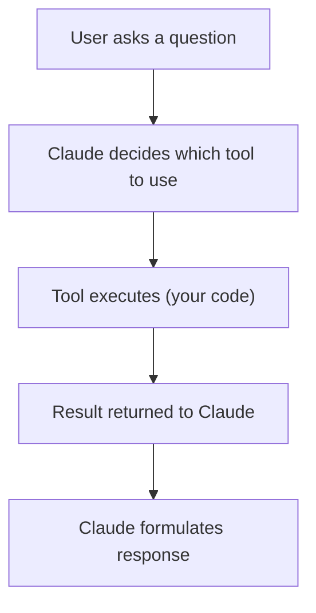

# Adding New Tools to the Agent

This guide explains how to add new tools to the Party Supply Chat Agent. Tools give the agent capabilities to search data, call APIs, or perform actions.

## How Tools Work



The Strands SDK uses a tool-calling pattern:
1. You define a tool with a name, description, input schema (Zod), and a callback function
2. Claude reads the tool descriptions and decides when to call them
3. Your callback runs and returns data
4. Claude uses the data to answer the user

## Step-by-Step: Add a New Tool

### 1. Create the Tool Implementation

Create a new file in `agent/tools/`. For example, `agent/tools/shipping.ts`:

```typescript
/**
 * Shipping estimation tool
 */

export async function estimateShipping(
  zipCode: string,
  weight: number
): Promise<{ days: number; cost: number }> {
  // Your logic here — call an API, query a database, etc.
  const baseDays = zipCode.startsWith("9") ? 2 : 4;
  const cost = weight * 0.5 + 4.99;
  return { days: baseDays, cost };
}
```

### 2. Register the Tool in `agent.ts`

Import your implementation and define the tool using the Strands `tool()` function:

```typescript
import { tool } from "@strands-agents/sdk";
import { z } from "zod";
import { estimateShipping } from "./tools/shipping.js";

const shippingTool = tool({
  name: "estimate_shipping",
  description:
    "Estimate shipping time and cost for a delivery. Use when a customer asks about delivery times or shipping costs.",
  inputSchema: z.object({
    zipCode: z.string().describe("Destination ZIP code"),
    weight: z.number().describe("Package weight in pounds"),
  }),
  callback: async (input) => {
    const result = await estimateShipping(input.zipCode, input.weight);
    return JSON.stringify(result);
  },
});
```

### 3. Add the Tool to the Agent

Add it to the `tools` array when creating the Agent:

```typescript
const agent = new Agent({
  model: "us.anthropic.claude-sonnet-4-5-20250929-v1:0",
  tools: [
    searchProductsTool,
    searchOrdersTool,
    searchAllTool,
    recallMemoryTool,
    shippingTool,  // <-- add here
  ],
  systemPrompt: SYSTEM_PROMPT,
});
```

### 4. Update the System Prompt (Optional)

If the tool introduces a new capability, mention it in the system prompt so Claude knows when to use it:

```typescript
const SYSTEM_PROMPT = `You are a helpful party supply customer service agent...

5. **Shipping Estimates** - Provide delivery time and cost estimates when customers ask
`;
```

### 5. Deploy

```bash
./scripts/deploy.sh --agent
```

## Tool Design Guidelines

| Guideline | Why |
|-----------|-----|
| Write clear descriptions | Claude uses the description to decide when to call the tool |
| Use descriptive parameter names | Helps Claude provide the right arguments |
| Return structured JSON | Easier for Claude to parse and present to users |
| Handle errors gracefully | Return error messages instead of throwing |
| Keep tools focused | One tool = one capability |

## Input Schema (Zod)

The `inputSchema` uses [Zod](https://zod.dev/) for validation and JSON schema generation:

```typescript
// String with description
z.string().describe("The customer's email address")

// Optional number with default
z.number().optional().describe("Max results (default: 5)")

// Enum
z.enum(["standard", "express", "overnight"]).describe("Shipping speed")

// Object
z.object({
  name: z.string(),
  quantity: z.number().min(1),
})
```

## Example: Adding an External API Tool

```typescript
const weatherTool = tool({
  name: "get_weather",
  description: "Get current weather for outdoor event planning",
  inputSchema: z.object({
    city: z.string().describe("City name"),
    date: z.string().describe("Date in YYYY-MM-DD format"),
  }),
  callback: async (input) => {
    try {
      const res = await fetch(
        `https://api.weather.example/forecast?city=${input.city}&date=${input.date}`
      );
      const data = await res.json();
      return JSON.stringify(data);
    } catch (error) {
      return `Weather data unavailable for ${input.city}`;
    }
  },
});
```

## Testing Tools Locally

Before deploying, test your agent locally:

```bash
cd agent
AWS_REGION=us-west-2 npx tsx -e "
import { Agent, tool } from '@strands-agents/sdk';
import { z } from 'zod';

// ... your tool definition ...

const agent = new Agent({
  model: 'us.anthropic.claude-sonnet-4-5-20250929-v1:0',
  tools: [yourNewTool],
  systemPrompt: 'Test agent',
});

const result = await agent.invoke('Test prompt that should trigger your tool');
console.log(result.toString());
"
```

## Adding Tools to the Gateway (Optional)

If you want the tool exposed directly via the MCP gateway (not through the runtime agent), update `lambda/tools.json`:

```json
[
  {
    "name": "chat",
    "description": "...",
    "inputSchema": { ... }
  },
  {
    "name": "your_new_tool",
    "description": "Direct tool exposed via gateway",
    "inputSchema": {
      "type": "object",
      "properties": {
        "param1": { "type": "string", "description": "..." }
      },
      "required": ["param1"]
    }
  }
]
```

Then update `lambda/index.mjs` to handle the new tool name and redeploy:

```bash
./scripts/deploy.sh --lambda --gateway-target
```
