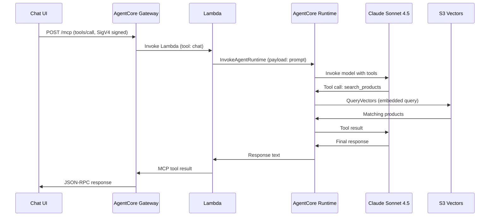

# Technical Features & Implementation Details

## AgentCore Memory (Long-term)

The agent uses AgentCore Memory with three built-in strategies:

| Strategy | Purpose | Namespace |
|----------|---------|-----------|
| `SEMANTIC` | Extracts factual information from conversations | `/facts/{actorId}/` |
| `SUMMARIZATION` | Creates session summaries | `/summaries/{actorId}/{sessionId}/` |
| `USER_PREFERENCE` | Learns customer preferences (themes, colors, budgets) | `/preferences/{actorId}/` |

Events expire after 30 days. Long-term records persist indefinitely.

### How It Works

1. Every user message and assistant response is stored as a short-term event via `CreateEventCommand`
2. AgentCore automatically runs extraction strategies on these events
3. The agent has a `recall_customer_context` tool that retrieves relevant long-term memories via `RetrieveMemoryRecordsCommand`
4. On future conversations, the agent can recall past preferences and facts

## S3 Vectors RAG

Product and order data is embedded using Amazon Titan Text Embeddings V2 (1024 dimensions, cosine distance).

- **Products index**: 20 party supply products with full descriptions, prices, themes
- **Orders index**: 10 customer orders with status, items, delivery info

The agent's `search_products`, `search_orders`, and `search_all` tools generate a query embedding and perform vector similarity search against S3 Vectors.

## Gateway → Lambda → Runtime Flow



## SDK Middleware (Content-Type Fix)

The `@aws-sdk/client-bedrock-agentcore` SDK doesn't set `Content-Type: application/json` when calling `InvokeAgentRuntimeCommand`. The runtime (Fastify-based) rejects requests without it (415). The Lambda adds a middleware to force the header:

```javascript
client.middlewareStack.add(
  (next) => async (args) => {
    if (args.request && args.request.headers) {
      args.request.headers["content-type"] = "application/json";
    }
    return next(args);
  },
  { step: "build", name: "forceJsonContentType", priority: "low" }
);
```

## SDK Response Parsing

The `InvokeAgentRuntimeCommand` response doesn't use `response.body` (streaming). Instead, the response is in `response.response` as an async iterable:

```javascript
const response = await client.send(command);
// response.body is undefined
// response.response is the actual content stream
for await (const event of response.response) { ... }
```

## Chat UI Features

- **SigV4 signing** in the browser using `@smithy/signature-v4`
- **Markdown rendering** via `react-markdown`
- **Activity indicators** showing real-time request flow (signing → gateway → agent → memory)
- **Metadata badges** on responses (tools called, memory stored, response time)
- **Scrollable messages** with max-height for long responses

## Deploy Script Internals

The deploy script auto-generates `agentcore/aws-targets.json` from your active AWS credentials — no manual configuration needed.

After deploying the agent, it automatically adds IAM permissions to the runtime execution role for:
- `s3vectors:QueryVectors` — RAG search
- `bedrock:InvokeModel` — Titan embeddings + Claude
- `bedrock-agentcore:CreateEvent` / `RetrieveMemoryRecords` — Memory

## Testing the Gateway Directly

```bash
# List available tools
curl -s --aws-sigv4 "aws:amz:us-west-2:bedrock-agentcore" \
  --user "$(aws configure get aws_access_key_id):$(aws configure get aws_secret_access_key)" \
  -H "Content-Type: application/json" \
  -H "x-amz-security-token: $(aws configure get aws_session_token)" \
  -X POST "https://GATEWAY_ID.gateway.bedrock-agentcore.us-west-2.amazonaws.com/mcp" \
  -d '{"jsonrpc":"2.0","id":"1","method":"tools/list","params":{}}'

# Invoke the chat tool
curl -s --aws-sigv4 "aws:amz:us-west-2:bedrock-agentcore" \
  --user "$(aws configure get aws_access_key_id):$(aws configure get aws_secret_access_key)" \
  -H "Content-Type: application/json" \
  -H "x-amz-security-token: $(aws configure get aws_session_token)" \
  -X POST "https://GATEWAY_ID.gateway.bedrock-agentcore.us-west-2.amazonaws.com/mcp" \
  -d '{"jsonrpc":"2.0","id":"2","method":"tools/call","params":{"name":"PartySupplyTarget___chat","arguments":{"prompt":"What birthday supplies do you have?"}}}'
```

## Key Learnings & Gotchas

| Issue | Fix |
|-------|-----|
| Docker Hub rate limits on CodeBuild | Use `public.ecr.aws/docker/library/node:22-slim` |
| `useradd: UID 1000 is not unique` | Use UID 1001 (node:22-slim uses 1000) |
| Model ID `us.anthropic.claude-sonnet-4-5-20250514` invalid | Correct: `us.anthropic.claude-sonnet-4-5-20250929-v1:0` |
| Lambda rejects `AWS_REGION` env var | Use `AGENT_REGION` (AWS_REGION is reserved) |
| S3 Vectors `create-index` missing param | Requires `--data-type float32` |
| Gateway target creation permission error | Lambda needs service principal + gateway role permissions |
| SDK `InvokeAgentRuntimeCommand` param | Use `agentRuntimeArn` (not `runtimeArn`) |
| Runtime returns 415 | SDK middleware to force `Content-Type: application/json` |
| SDK response body empty | Response is in `response.response` field |
| Runtime RAG tools access denied | Runtime role needs `s3vectors:QueryVectors` + `bedrock:InvokeModel` |
| `agentcore deploy` CDK build fails | Run `npm install` in `agentcore/cdk/` first |
| macOS `grep -P` unavailable | Use `grep -o` with `sed` |
| CDK lock conflict | Delete `agentcore/cdk/cdk.out` before retry |
| Gateway won't delete | Delete all targets (by `--target-id`) first |
| `npx tsx` prompts in CI | Use `npx --yes tsx` or install globally |
| Orphaned gateway blocks redeploy | Delete via `aws bedrock-agentcore-control delete-gateway` |
