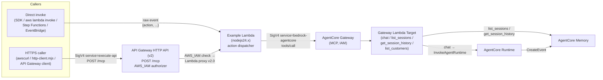

# AWS Lambda → AgentCore Gateway MCP Client

This example deploys a small AWS Lambda function that calls the Party Supply gateway's MCP tools (`chat`, `list_sessions`, `get_session_history`) using AWS SigV4. The Lambda authenticates with its **execution-role credentials** — no static API keys, no STS exports — so it's the pattern you'd use to embed AgentCore into a backend workflow (API Gateway, Step Functions, EventBridge, downstream Lambdas).

`deploy.sh` also provisions an **API Gateway HTTP API (v2) with `AWS_IAM` authorization** in front of the Lambda. That gives you a public-ish HTTPS endpoint (`POST /mcp`) that callers sign with SigV4 against `service=execute-api`. Two invocation paths from one Lambda.

Companion to the [browser SDK example](../nodejs-client/) and [stand-alone Node CLI](../nodejs-client/session-history.js).

## Architecture



A few things this diagram makes concrete:

- **One Lambda, two transports.** The handler detects API Gateway proxy events (`requestContext.http`) vs. direct invokes — direct returns the raw `{ok, action, result}` object; HTTP returns `{statusCode, headers, body}` proxy format.
- **Two SigV4 chains, different services.** Callers sign against `execute-api` for the HTTP API; the Lambda then signs against `bedrock-agentcore` for the AgentCore gateway. Each hop authenticates the next, no static keys anywhere.
- **`AWS_IAM` authorizer on `POST /mcp`.** Cheaper than REST API ($1/M calls vs $3.50/M), built-in Lambda proxy integration, and no separate authorizer resource — just one flag on the route.
- **IAM is per-transport.** Caller needs `execute-api:Invoke` on the route ARN; Lambda execution role needs `bedrock-agentcore:InvokeGateway`. `deploy.sh` wires both.

## What it does

The handler in [`index.mjs`](index.mjs) dispatches on `event.action`:

| Action | Calls | Use case |
|---|---|---|
| `chat` | `PartySupplyTarget___chat` | Send a prompt, get back the agent's ChatResponse envelope (cards, chips, etc.). |
| `list_sessions` | `PartySupplyTarget___list_sessions` | List a customer's last-48h conversations (configurable). |
| `get_session_history` | `PartySupplyTarget___get_session_history` | Fetch a single session's full user/assistant timeline. |

Each call:
1. Resolves credentials from the Lambda execution role via `fromNodeProviderChain()`.
2. SigV4-signs a JSON-RPC POST to `${GATEWAY_URL}/mcp` using `service=bedrock-agentcore`.
3. Unwraps the MCP `content[0].text` envelope and `JSON.parse`s it into the structured payload defined in [lambda/tools.json](../../lambda/tools.json).

## Prerequisites

- AWS CLI v2, configured (`aws sts get-caller-identity` works)
- The main Party Supply gateway already deployed (`./scripts/deploy.sh` from repo root)
- `zip` or `7z` on PATH for the deploy script's packaging step
- Local Node.js 22+ if you want to invoke or test it locally (Lambda itself runs `nodejs24.x`)

## Deploy

One script does everything — IAM role, packaging, function create/update:

```bash
cd examples/lambda-mcp-client
./deploy.sh
```

The script auto-detects the gateway URL by searching for a `PartySupply*` gateway in the region. To target a different gateway or non-default region:

```bash
AWS_REGION=us-east-1 \
AGENTCORE_GATEWAY_URL="https://your-gateway.gateway.bedrock-agentcore.us-east-1.amazonaws.com" \
./deploy.sh
```

Other env-var overrides:

| Var | Default | Effect |
|---|---|---|
| `LAMBDA_NAME` | `agentcore-lambda-example` | Lambda function name. |
| `ROLE_NAME` | `agentcore-lambda-example-role` | IAM execution role name. |
| `TIMEOUT` | `60` | Lambda timeout (seconds). |
| `MEMORY` | `256` | Memory (MB). |
| `MCP_TARGET_PREFIX` | `PartySupplyTarget` | Gateway target name (used as the namespace prefix). |
| `API_NAME` | `agentcore-lambda-example-api` | HTTP API name. |
| `API_STAGE` | `prod` | HTTP API stage. |
| `DEPLOY_API` | `1` | Set to `0` to skip the API Gateway step (Lambda-only deploy). |

## Payload reference

The Lambda accepts the same payload shape on both transports — `aws lambda invoke` (direct) and `POST /mcp` on the HTTP API (HTTP body). Pick an `action`, fill in its required fields, and optionally set anything from the optional column. Replace `$URL` with the HTTP API URL `deploy.sh` prints (e.g. `https://abc123def4.execute-api.us-west-2.amazonaws.com/prod/mcp`).

### `action: "chat"`

Send a prompt to the agent and get back a structured ChatResponse envelope.

| Field | Required | Type | Default | Notes |
|---|---|---|---|---|
| `action` | yes | `"chat"` | — | Dispatch discriminator. |
| `prompt` | yes | string | — | The user's message. |
| `actorId` | no | string | — | Customer / user ID. Enables profile-aware personalization. Sent to the runtime as `userId`. |
| `sessionId` | no | string | (random) | Reuse a sessionId so turns accrue into the same AgentCore Memory session. |
| `conversationHistory` | no | `[{role, content}]` | `[]` | Prior turns to seed context for stateless callers. |

**Request payload:**

```json
{
  "action": "chat",
  "prompt": "Show me a balloon set for a beach party",
  "actorId": "CUST-100005",
  "sessionId": "session-from-some-orchestrator",
  "conversationHistory": [
    { "role": "user", "content": "I'm planning a kids' birthday" },
    { "role": "assistant", "content": "Got it - any theme in mind?" }
  ]
}
```

**HTTP API (`awscurl`):**

```bash
awscurl --service execute-api --region us-west-2 -X POST \
  -d '{"action":"chat","prompt":"Show me a balloon set for a beach party","actorId":"CUST-100005"}' \
  $URL
```

**Direct Lambda invoke:**

```bash
aws lambda invoke --function-name agentcore-lambda-example --region us-west-2 \
  --cli-binary-format raw-in-base64-out \
  --payload '{"action":"chat","prompt":"Show me a balloon set for a beach party","actorId":"CUST-100005"}' \
  ./out.json && cat ./out.json
```

**Response:** `{ ok, action: "chat", result: { envelope: { type, message, recommendations?, followups? }, response: string } }`.

### `action: "list_sessions"`

List a customer's recent conversations, ordered by most-recent activity.

| Field | Required | Type | Default | Notes |
|---|---|---|---|---|
| `action` | yes | `"list_sessions"` | — | Dispatch discriminator. |
| `actorId` | yes | string | — | The customer / user identifier. |
| `windowHours` | no | number | `48` | Convenience window. `168` = 1 week. Ignored if `sinceMs` is set. |
| `sinceMs` | no | number | (derived) | Explicit epoch-ms lower bound on `lastEventAt`. Takes precedence over `windowHours`. |
| `maxSessions` | no | number | `20` | Cap on returned sessions (hard cap 100). |

**Request payload:**

```json
{
  "action": "list_sessions",
  "actorId": "CUST-100005",
  "windowHours": 48,
  "maxSessions": 20
}
```

**HTTP API (`awscurl`):**

```bash
awscurl --service execute-api --region us-west-2 -X POST \
  -d '{"action":"list_sessions","actorId":"CUST-100005","windowHours":48,"maxSessions":20}' \
  $URL
```

**Direct Lambda invoke:**

```bash
aws lambda invoke --function-name agentcore-lambda-example --region us-west-2 \
  --cli-binary-format raw-in-base64-out \
  --payload '{"action":"list_sessions","actorId":"CUST-100005","windowHours":48,"maxSessions":20}' \
  ./out.json && cat ./out.json
```

**Response:** `{ ok, action, result: { sessions: [{sessionId, actorId, createdAt, lastEventAt, firstPrompt}], totalReturned } }`. Sorted by `lastEventAt` desc.

### `action: "get_session_history"`

Fetch the full user/assistant timeline for a single session.

| Field | Required | Type | Default | Notes |
|---|---|---|---|---|
| `action` | yes | `"get_session_history"` | — | Dispatch discriminator. |
| `actorId` | yes | string | — | The customer / user identifier. |
| `sessionId` | yes | string | — | The session whose events to return. |
| `maxResults` | no | number | `100` | Cap on returned events. |

**Request payload:**

```json
{
  "action": "get_session_history",
  "actorId": "CUST-100005",
  "sessionId": "session-1780951267383-7bm7iut",
  "maxResults": 100
}
```

**HTTP API (`awscurl`):**

```bash
awscurl --service execute-api --region us-west-2 -X POST \
  -d '{"action":"get_session_history","actorId":"CUST-100005","sessionId":"session-1780951267383-7bm7iut"}' \
  $URL
```

**Direct Lambda invoke:**

```bash
aws lambda invoke --function-name agentcore-lambda-example --region us-west-2 \
  --cli-binary-format raw-in-base64-out \
  --payload '{"action":"get_session_history","actorId":"CUST-100005","sessionId":"session-1780951267383-7bm7iut"}' \
  ./out.json && cat ./out.json
```

**Response:** `{ ok, action, result: { messages: [{role, content, timestamp}], totalReturned } }`. Sorted oldest-first.

### Error responses

Any handler error returns `{ ok: false, action, error: "<message>" }` (HTTP 400 over the HTTP API). Auth failures from the AgentCore gateway surface as `"... failed (403): Authorization error - Insufficient permissions"` — fix by extending the Lambda execution role's `bedrock-agentcore:InvokeGateway` permission. Auth failures from the HTTP API itself never reach the Lambda; they return `{"message":"Forbidden"}` (caller is missing `execute-api:Invoke` on the route ARN).

## Invoke

The deploy script prints ready-to-paste invocations for both transports. Quick examples — the **payload bodies are identical**; only the envelope changes per transport.

### Direct Lambda invoke

```bash
aws lambda invoke --function-name agentcore-lambda-example --region us-west-2 \
  --cli-binary-format raw-in-base64-out \
  --payload '{"action":"list_sessions","actorId":"CUST-100005","windowHours":168}' \
  ./out.json && cat ./out.json
```

Same shape for `chat` and `get_session_history` — swap the payload from the [reference tables above](#payload-reference).

## Invoke via the HTTP API (SigV4 against execute-api)

After `deploy.sh` finishes you'll see an invoke URL like:

```
https://abc123def4.execute-api.us-west-2.amazonaws.com/prod/mcp
```

This route is protected by `AWS_IAM` authorization. Any caller needs:
- AWS credentials in the standard chain (env vars, profile, instance role).
- `execute-api:Invoke` on the route ARN — typically `arn:aws:execute-api:us-west-2:<acct>:<api-id>/*/POST/mcp`.

### awscurl one-liner

[`awscurl`](https://github.com/okigan/awscurl) (`pip install awscurl`) is the easiest way to test. The `-d` body matches the [payload reference tables above](#payload-reference):

```bash
awscurl --service execute-api --region us-west-2 -X POST \
  -d '{"action":"list_sessions","actorId":"CUST-100005"}' \
  https://abc123def4.execute-api.us-west-2.amazonaws.com/prod/mcp
```

### Node client

The bundled [`http-client.mjs`](http-client.mjs) wraps SigV4 signing for `execute-api` and accepts the same payload fields as the [reference tables above](#payload-reference):

```bash
export AGENTCORE_HTTP_API_URL=https://abc123def4.execute-api.us-west-2.amazonaws.com/prod/mcp
npm install   # if you haven't already

node http-client.mjs list_sessions       CUST-100005
node http-client.mjs get_session_history CUST-100005 session-1780951267383-7bm7iut
node http-client.mjs chat "What do you have for a beach party?" CUST-100005
```

### Programmatic snippet (your own code)

```javascript
import { SignatureV4 } from "@smithy/signature-v4";
import { HttpRequest } from "@smithy/protocol-http";
import { Sha256 } from "@aws-crypto/sha256-js";
import { fromNodeProviderChain } from "@aws-sdk/credential-providers";

const url = new URL(process.env.AGENTCORE_HTTP_API_URL);
const body = JSON.stringify({ action: "list_sessions", actorId: "CUST-100005" });

const signer = new SignatureV4({
  service: "execute-api",                  // ← not "bedrock-agentcore"
  region: process.env.AWS_REGION,
  credentials: await fromNodeProviderChain()(),
  sha256: Sha256,
});
const signed = await signer.sign(new HttpRequest({
  method: "POST",
  protocol: url.protocol,
  hostname: url.hostname,
  path: url.pathname,
  headers: { host: url.hostname, "content-type": "application/json" },
  body,
}));

const res = await fetch(url, { method: "POST", headers: signed.headers, body });
const data = await res.json();
```

The only difference vs. the direct-gateway pattern in [examples/nodejs-client/](../nodejs-client/) is the `service:` value (`execute-api` instead of `bedrock-agentcore`) — everything else is the same.

## IAM

The deploy script creates an execution role with:

- `AWSLambdaBasicExecutionRole` (managed) — CloudWatch Logs.
- `InvokeAgentCoreGateway` (inline) — `bedrock-agentcore:InvokeGateway` (authorizes the SigV4-signed `POST /mcp` call to the AgentCore gateway) and `:InvokeAgentRuntime` on `Resource: "*"`.

For the HTTP API surface, the **caller's** principal needs `execute-api:Invoke` on the route ARN. Example caller policy:

```json
{
  "Version": "2012-10-17",
  "Statement": [{
    "Effect": "Allow",
    "Action": "execute-api:Invoke",
    "Resource": "arn:aws:execute-api:us-west-2:123456789012:abc123def4/*/POST/mcp"
  }]
}
```

In production, scope all `Resource: "*"` entries down to the specific gateway / API ARN. The example keeps them broad so the function still works after `./scripts/deploy.sh --clean` recreates infra with new IDs.

## Integrating from your own Lambda

If you'd rather embed the client directly into your existing code, you only need three pieces:

```javascript
import { SignatureV4 } from "@smithy/signature-v4";
import { HttpRequest } from "@smithy/protocol-http";
import { Sha256 } from "@aws-crypto/sha256-js";
import { fromNodeProviderChain } from "@aws-sdk/credential-providers";

const credentialProvider = fromNodeProviderChain();

async function callTool(toolName, args) {
  const credentials = await credentialProvider();
  const url = new URL(`${process.env.AGENTCORE_GATEWAY_URL}/mcp`);

  const signer = new SignatureV4({
    service: "bedrock-agentcore",
    region: process.env.AWS_REGION,
    credentials,
    sha256: Sha256,
  });
  const body = JSON.stringify({
    jsonrpc: "2.0",
    id: Date.now().toString(),
    method: "tools/call",
    params: { name: `PartySupplyTarget___${toolName}`, arguments: args },
  });
  const signed = await signer.sign(new HttpRequest({
    method: "POST",
    protocol: url.protocol,
    hostname: url.hostname,
    path: url.pathname,
    headers: { host: url.hostname, "content-type": "application/json" },
    body,
  }));
  const res = await fetch(url, { method: "POST", headers: signed.headers, body });
  const data = await res.json();
  return JSON.parse(data.result.content[0].text);
}
```

That's the entire integration surface — Lambda runtime ships `@aws-sdk/*` and `@smithy/*` preinstalled on nodejs24.x, so bundling is optional.

## Troubleshooting

**"AGENTCORE_GATEWAY_URL env var is required"** — Lambda env var didn't get set. Re-run `deploy.sh` (it auto-populates this from your gateway) or set it manually via `aws lambda update-function-configuration --environment ...`.

**`Authorization error - Insufficient permissions` from the gateway** — execution role is missing `bedrock-agentcore:InvokeGateway`. Verify with `aws iam list-role-policies --role-name agentcore-lambda-example-role` then `aws iam get-role-policy ... --policy-name InvokeAgentCoreGateway`.

**`Internal server error` from the gateway** — most often a stale gateway target. Re-run `./scripts/deploy.sh --gateway-target` from the repo root to refresh the tool schema.

**HTTP API returns `{"message":"Forbidden"}`** — caller's principal isn't authorized for `execute-api:Invoke` on the route. Add the policy snippet from the IAM section above. If you SigV4-signed against the wrong service, you'll see the same error — make sure `service` is `execute-api`, not `bedrock-agentcore`.

**HTTP API returns `{"message":"Missing Authentication Token"}`** — request URL or method is wrong. The route is `POST /mcp`; a `GET` to the same path will also return this.

**Tool name not found (`PartySupplyTarget___X`)** — `MCP_TARGET_PREFIX` doesn't match the deployed gateway target name. List targets via:

```bash
GW=$(aws bedrock-agentcore-control list-gateways --region us-west-2 \
  --query "items[?contains(name,'PartySupply')].gatewayId|[0]" --output text)
aws bedrock-agentcore-control list-gateway-targets --gateway-identifier "$GW" --region us-west-2
```

## Cleanup

```bash
# HTTP API
API_ID=$(aws apigatewayv2 get-apis --region us-west-2 \
  --query "Items[?Name=='agentcore-lambda-example-api'].ApiId | [0]" --output text)
[ "$API_ID" != "None" ] && aws apigatewayv2 delete-api --api-id "$API_ID" --region us-west-2

# Lambda
aws lambda delete-function --function-name agentcore-lambda-example --region us-west-2

# IAM
aws iam delete-role-policy --role-name agentcore-lambda-example-role --policy-name InvokeAgentCoreGateway
aws iam detach-role-policy --role-name agentcore-lambda-example-role \
  --policy-arn arn:aws:iam::aws:policy/service-role/AWSLambdaBasicExecutionRole
aws iam delete-role --role-name agentcore-lambda-example-role
```

## Related

- [Browser/Node CLI example](../nodejs-client/) — same MCP calls from a local shell or React app.
- [Main README — Calling from any MCP client](../../README.md#recent-conversations-sidebar-ui).
- [lambda/tools.json](../../lambda/tools.json) — full inputSchema / outputSchema for all four MCP tools.
